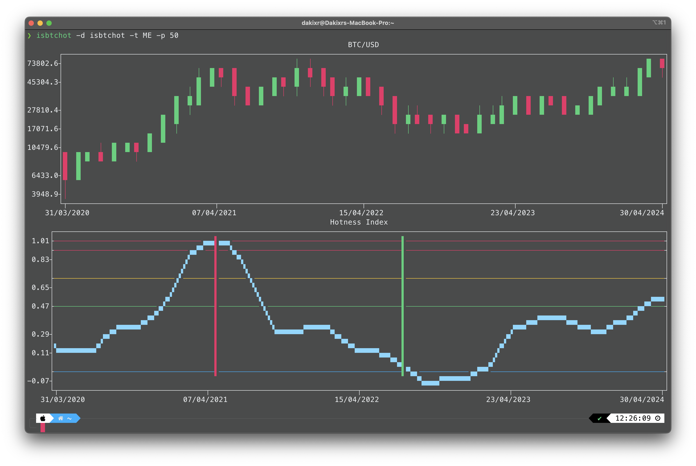

# isbtchot: BTC Hotness Index Dashboard

The `isbtchot` package provides a minimalist terminal dashboard for BTC's hotness index. It uses historical BTC data to create both BTC's price and Hotness Index visualizations right in your terminal.

# Demo




## Features:

- BTC monthly candlestick plot with log scale.
- Hotness index based on PI with buy/sell signals.
- Data is cached to speed up subsequent requests.

## Installation

```bash
pip install isbtchot
```
## Usage

You can run the main dashboard with:

```bash
python -m isbtchot [year]
```

Where `year` is an optional argument to specify the number of years of data you want to visualize. By default, it uses 7 years of data.

### Command Line Arguments

| Argument | Type | Description | Default |
|---|---|---|---|
| year | int | The year to be processed. Determines the duration for data visualization. | 7 |

## Implementation Details

### Directories and Files

- **__init__.py**: Contains root path to support relative paths in other modules.
- **__main__.py**: Main script to parse command-line arguments and invoke the dashboard.
- **controller.py**: The controller module orchestrates data retrieval and visualization.
- **model.py**: Manages data retrieval from CryptoCompare API and data processing.
- **view.py**: Handles all the terminal-based visualizations using `plotext` package.

### BTC PI Calculation

The PI (Price Indicator) is based on the moving averages of BTC's daily price. Here's a brief overview:

- **SMA111**: 111-day Simple Moving Average of the price.
- **SMA350x2**: Double the 350-day Simple Moving Average of the price.
- **PI**: `SMA111 / SMA350x2`.

Sell and buy signals are determined based on the PI values:

- **Sell Signal**: When PI shifts from being >=1 to <1.
- **Buy Signal**: When PI shifts from being <=0.35 to >0.35.

## Dependencies

- **plotext**: For terminal-based plots.
- **pandas**: For data manipulation.
- **numpy**: Mathematical operations.
- **requests**: To fetch BTC historical data.

## Notes

- Ensure the terminal window is maximized for optimal visualization.
- Data is fetched from CryptoCompare API and cached locally for performance.

## Contributions

Please raise an issue or provide a pull request for any enhancements, bug fixes or features you'd like to add.